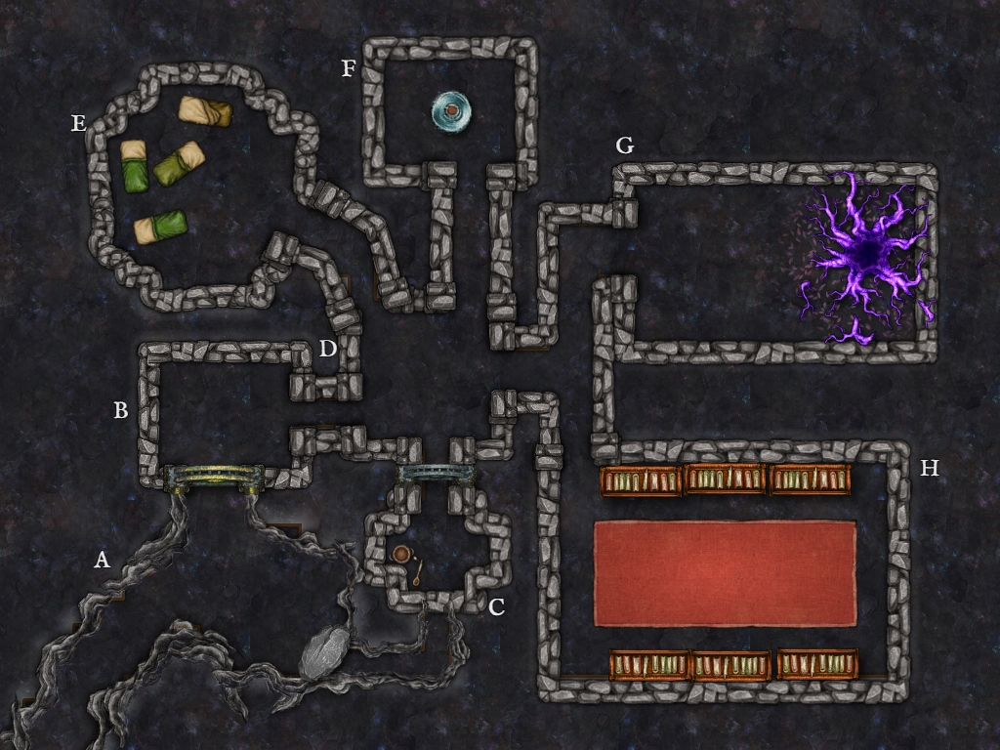

+++
title = 'The Library of the Ascendants'
tags = ['adventure-design', 'dungeon-design']
author = 'Ahobo'
date = '2025-01-22'
+++

Something a little different. I have recently gotten my hands on [Gentle's Dungeon Guide 2](https://www.drivethrurpg.com/en/product/467300/gentle-s-dungeon-guide-2) a nice little dungeon generator for Shadowdark. However, it really can be used for just about any fantasy RPG. Using it, I was able to generate a little dungeon adventure that I am going to share here. 

Game masters looking for a quick adventure can use this as a base. Players wishing to play this should give this to their game masters and stop reading now! Lest they be spoiled.

## The Background

This dungeon is an underground library located near a ley line. The original creators of the library was a group of magic users that used the nearby ley line as fuel to perform powerful magical rituals. For many years the wizards recorded their magical discoveries in the library. They where able to craft a powerful magical relic known as **The Arcane Accord** (what this magical artifact does is left to the game master running this adventure to decide). One day, the wizards performed a ritual that killed all of them. The Library has been visited by other groups but no one has stayed. Fewer still have returned...

Currently, the library is occupied by a reclusive but otherwise friendly group of bug people called the **Klaxi**. They are a scouting party of the main hive and are trying to close the ley line to make the location safe for settlement. They currently believe that the magics of the location are driving some of their ranks to madness.

Unfortunately for the Klaxi and other intruders, one of the original mages of the Library still lives. Now known as **The Miscreant** this shapeshifting mage has killed one of the Klaxi and taken his place amongst their ranks. He uses them as unwitting subjects for his magical research. Driving the ones that survive to madness. He tricked his original mage friends into performing a ritual that he claimed would grant them all immortality. In reality, he sacrificed them to grant himself immortality. The ritual was only partially successful. Greatly extending his life, but not granting immortality. It also turned him into a changeling. He hopes to trick a group of adventurers into taking **The Arcane Accord** and allowing him to perform the ritual of immortality again. Letting him become a true immortal.

## Hooks

Players might be tempted to enter the library by...

- having a patron pay them handsomely for **The Arcane Accord**.
- replacing the **The Arcane Accord** with some other important relic the group must acquire.
- informing players that the location might have the secrets of immortality.

## Key Truths

For the GM's convenience, here are some key pieces of information that could help with running this dungeon.

1. **The Miscreant** is responsible for the current state of the library. He tricked his compatriots into performing a ritual that cost them all their lives and turned him into a changeling.
2. **The Miscreant** desperately wants to perform the ritual again and has already done so a few times. The **Mutated Klaxi** in area **G. Ley Line** are a result of his trickery.
3. **The Miscreant** can perform the ritual on the party. I leave the exact result of this to the GM. It is possible that the crazed mage can get it right this time and the group are turned into powerful avatars. Or they are made into mindless thralls.
4. **The Klaxi** are unaware of **The Miscreant**. 
5. **The Klaxi** want to close the ley line and make this place into a home. After the ley line is closed they have no further use for the **Arcane Accord**.
6. To close the ley line, the party must find the books with the ritual in area **C. Clustered Closet**.

## Ley Line Influence

The nearby ley line can be used simply to flavor the looks of the environment. Floating rocks and sparks of magic here and there. However, it could also be an excuse to make spells a little stronger in the Library... At a cost! Any time a spell is cast, roll a D6. If the result is a 1, the spell is cast on the caster instead. If the roll is a 6, the target of the spell does not get a save against the effects of the spell.

## Room Key Format

The dungeon rooms appear in the following format:

**Room Name**: some key descriptor words.
- **Obvious information about the room that can be seen without looking closer** \[hidden information that you need to get closer to see]
	- secret information that requires a check to find.

## NPC Key Format

Some key NPCs are keyed in this adventure as follows.

**NPC Name**: key characteristics and looks. (weak, standard, strong)
- background
- motivation
- flaw or weakness or quirk.

No stat blocks are provided since I wanted to have this adventure be system neutral. I added a tag to let the game master know about how strong the NPC is meant to be.
## A. Entrance

**Entrance Passage**: gloomy cave.
- **Small rocks floating** \[small flickering bolts of arcane energy passing between them.]
- **Library entrance doors are 20ft tall with gold embellishing and intricate stone work**
- **Very feint smell of rot** \[coming from south east wall]
	- a successful check or touching the stone wall reveals that it is illusory and the passage to **Room C: Closet** is revealed.

## B. Library Entrance

**Ascendants' Reception**: small dusty square room.
- **Rotten wood receptionist desk** \[books contain records of visitors from ancient kingdoms]
	- moving the books causes the ghost to scream, causing damage
- **Ghost of mage, almost invisible seated at desk, reading** \[book he is reading is also ghostly and has no text]
	- check might warn party that its not a good idea to disturb the ghost.
	- disturbing the books causes the ghost to scream causing damage
	- alerts **Kitax** in next room of the group. Comes looking for them.
	- disappears after. 
- **Prints in dust leading into next room** \[few human, most are not. clearly more than one]
	- check might tell party that there are prints of bug people as well as one person.

## C. Clustered Closet

**Clustered Closet**: full of cleaning tools, smells bad.
- **Wooden buckets stack and brooms** \[moldy and unused in a very long time.]
	- small dirty sleeping bag is hidden behind stack of buckets.
	- source of bad smell
- **Wooden dresser**: \[full of dirty purple robes with gold lining that has long since rusted.]
	- a check reveals a secret cubby with books. These books detail rituals that could theoretically close ley line. Wanted by **Keytax**. Finding these makes group hostile to **The Miscreant**.

## D. Central Reading Room

**Main Corridor**:  Carved out group reading room.
- **Central table with a bug person reading a tomb** \[Kitax is one of the Klaxi grunts assigned to finding a way to close the ley line. He is surprised at the group but not outright hostile.]
	- attempts to flee to **F. Artifact Room** if attacked.
	- can be convinced to bring group to leader in **F. Artifact Room** if they promise to help.
- **Central table has a few books, Kitax does not mind if group looks** \[most are logs of magical research. last log describes "ritual of ascension"]
- **Painting of mages** \[one of the mages is particularly flashy with gold laced purple robes.]

**Kitax**: man with the head of a preying mantis. Thinks he is good looking. (weak)
- grunt of the Klaxi
- looking for any spell that could help with closing the ley line
- is not smart enough to actually accomplish his goal.

## E. Emptied Lab

**Emptied Lab**: mossy wood tables pushed to walls. Sleeping bags all over. Two Klaxi to far side.
- **One Klaxi stands over another who is sleeping in a sleeping bag** \[the standing one is surprised by the group.]
	- has a giggly personality. happy to talk with group after he sees they are not from here.
	- reveals himself as **The Miscreant**.
	- **Miscreant** will attempt to stop party from looking at sleeping Klaxi.
	- if party insists, he does not stop them -> they see he is dead.
	- if the party does not get closer check reveals he is dead.

**The Miscreant**: "Ascended" Wizard turned Changeling. Featureless black skin, ruined purple robe and a satchel (holds the book with the ley line closing spell). (Powerful boss monster)
- was one of original wizards of this place. Gives this info freely.
- wants to sacrifice more people so he can fully ascend. Will lie and charm his prey to do so. Knows book for closing ley line is in dresser in area **C.Clustered Closet** . Will not tell without force. Needs the **Arcane Accord** to perform the ritual.
- powerful, but not immortal. He has killed Klaxi and they would help group kill him if they could be convinced to do so.

## F. Artifact Room

**Artifact Room**: cleaned up with a large glass jar in center, shelves of smaller jars on the walls. A larger bug man and 2 others observe the jars with great interest.
- **Central Jar with The Arcane Accord within** \[**Keytax**, leader of the Klaxi protects this jar. He does not know how to use the Accord but knows it is key for closing the ley line]
- **Shelves of jars** \[jars hold pickled body parts of various creatures.]

**Keytax**: Regal and tall. Eloquent. Charming. (strong)
- Knows a little about magic. can tell that **The Arcane Accord** is tied to the ley line somehow and is needed for its closing. Is in command, but is not micro managing. Lets his subordinates do their own thing.
- Wants to find the ritual for closing the Ley Line and protect his people. Will not allow the **Arcane Accord** to be taken. Will fight if needed. Gives this info freely.
- Knows there is something strange in this place. Will be grateful to group if they can kill the **Miscreant** (does not know about his shapeshifting powers or how he is killing them off.)
- Keytax is naive. He knows this place is dangerous but does not fully understand the extent of the danger. Thinks the strange happenings his group has suffered from are just a result of the ley line's magic.
**Two Klaxi Guards**: (standard)
- protect their leader. **Keytax**

## G. Ley Line

**Sanctorum Arcanum**: mostly empty aside for a crackling rip in reality. Natural cave walls unlike the stone brick of other rooms.
- **Ley Line** \[those that know magic may attempt to tap into this power source to perform powerful rituals.]
	- this ley line is the power source for the **ritual of ascension**.
	- **The Miscreant** brings the party here to perform the ritual if the party agrees to it willingly.
	- **Keytax** avoids this place.
- **Stepping closer** \[if the group steps closer, 3 mutated Klaxi jump down on the party. Feverishly fighting]
	- mutated Klaxi remain bug like, but skin is all black.

**Mutated Klaxi**: All black insectoid people. 
- mindlessly feast on ley line magics. attack others on site.

## H. Grand Library

**Grand Library**: Smell of old paper and mold permeates this large library room.
- **Shelves of books** \[most of them pertain to different rituals performed in this place. Rituals cover everything from turning lead to gold and life extending magic. Some books are missing]
	- missing books are in area **C. Clustered Closet**.

## Possible Endings

Some details are left up to the GM and the groups actions however, most groups might find themselves ending this dungeon
with some of the following...

1. The group kills **The Miscreant** and helps the Klaxi.

In this case, the Klaxi give the **Arcane Accord** freely after closing the ley line. The group is free to go and collect their
reward or use the Accord in some other way.

2. The group sides with **The Miscreant**.

More chaotic groups might find the temptation of immortality to great to resist. In this case, they must kill the
Klaxi and bring the Accord to the Miscreant. 

Weather the group is rewarded or punished for this course of action is left to the GM. Personally, I think it would
be kinda cool to allow the ritual to grant the group some sort of boon but at a price. Perhaps they are stronger,
but look like the Miscreant and dont have the natural ability to change form. Or maybe they are infused with arcane
energy and power, but their bodies are made frail. It might even be fun to have the group be transported to another
dimension. The sky is the limit when magic is involved.

3. The group kills everyone.

The Klaxi and the Miscreant will not part with the Accord freely. A group that is purely focused on obtaining the
Accord will have to kill both factions.

If this is used in an ongoing campaign, then it might be good to remember that this location has an unattended ley
line. It is possible that other factions will capitalize on this or some other consequences can come from this fact.